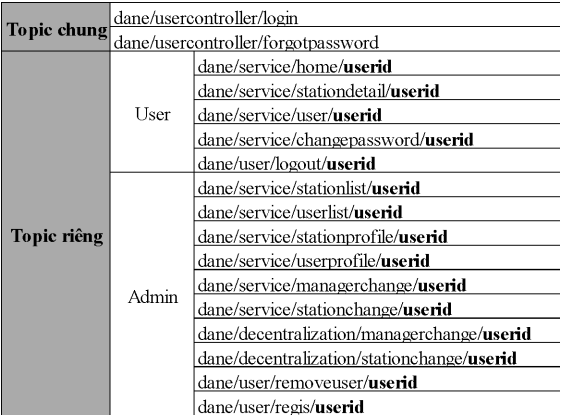

# Hệ thống quản lý trạm quan trắc khí tượng thủy văn
## Client app
Phần mềm khách sử dụng MAUI, biểu đồ và một vài bảng thông tin sử dụng công cụ Syncfusion để vẽ. Giao thức giao tiếp chính được sử dụng là MQTT ngoài ra còn có SMTP để gửi mail.   
  
Quy ước Topic chung và riêng như ảnh trên.
Mỗi một topic tương ứng với 1 chức năng cụ thể.
- Login:
  - SendMessage: UserID, EncodePass.
  - ReceiveMessage: JWT.
- ForgotPassword: 
  - SendMessage: UserID, VerificationCode.
- RecentSstationStatus(HomeView):
  - SendMessage: JWT.
  - ReceiveMessage: StationName, StationAddress, SeaLevel, WaveHeight, WaveLength, WaveHeightMax, WindSpeed, WindSpeedAt2mHeight, AverageWindSpeedIn2s, WindDirection, WindDirectionAt2mHeight, AverageWindDirectionIn2s.
- StationDetail:
  - SendMessage: JWT.
  - ReceiveMessage: StationName, StationAddress, SeaLevel, WaveHeight, WaveLength, WaveHeightMax, WindSpeed, WindSpeedAt2mHeight, AverageWindSpeedIn2s, WindDirection, WindDirectionAt2mHeight, AverageWindDirectionIn2s.
...
